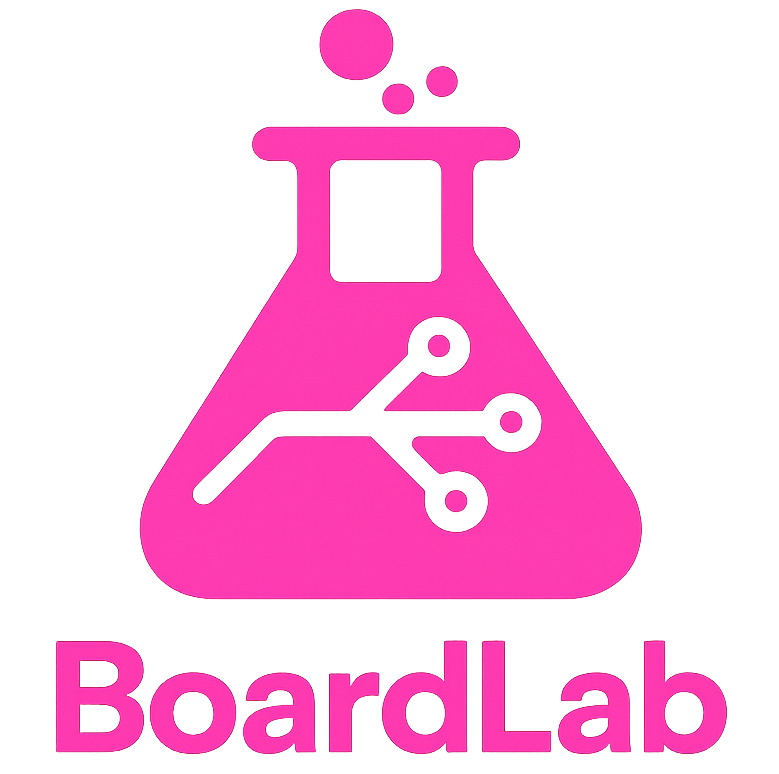

# BoardLab

  <table>
    <tr>
      <td align="center" width="48">
         
        
      </td>
      <td align="left">
         
        Vendor-independent board development for Visual Studio Code, powered by Arduino CLI.
      </td>
    </tr>
  </table>

> [!WARNING]
> **BoardLab is in early alpha.**
>
> APIs, UX details, and configuration may change without notice.
> If you need a production-stable Arduino IDE experience today, please use Arduino IDE 2.x.
> BoardLab is for early adopters, contributors, and power users who want to help shape the future of vendor-independent board development in Visual Studio Code.
>
> ---
>
> ### Community Feedback
>
> > "BoardLab" is another extension that makes VS Code into a full Arduino IDE equivalent. It is a very young project still in the alpha development phase. However, it is quite notable because it was created by @dankeboy36, who is the same person who brought us the "ESP Exception Decoder" extension for Arduino IDE 2.x, as well as other very significant and high quality contributions to the Arduino ecosystem.
> >
> > — @ptillisch, [Arduino Forum](https://forum.arduino.cc/t/problems-installing-vscode-and-platformio/1424230/12#p-8356780-boardlab-7)
>
> BoardLab is being built in public. Early feedback — positive and critical — is welcomed.

---

BoardLab for Visual Studio Code aims to be feature-complete with Arduino IDE 2.x, while staying fully open, power-user friendly, and strictly native to VS Code's UX.

All builds, uploads, board management, library management, and metadata are handled by the official Arduino CLI.

Arduino libraries, board packages, and toolchain binaries are downloaded exclusively from official Arduino servers.

BoardLab is **not affiliated with Arduino**. It uses the official Arduino CLI.

---

## Features

BoardLab focuses on removing friction from Arduino development workflows inside VS Code.

Current features include:

- Board, port, and sketch management from Visual Studio Code
- Compile, upload, and archive sketches using the Arduino CLI
- **Multi-sketch support**:
  - Discover and manage multiple sketches across all Visual Studio Code workspace folders
  - Import and work with multiple sketches without opening more than one Visual Studio Code window
- **Built-in serial monitor and plotter**:
  - Implemented as custom text editors, allowing views to be detached from the main Visual Studio Code window
  - Designed for multi-window workflows where editing, uploading, and monitoring happen in parallel
  - Shared underlying HTTP server coordinating serial port access across windows
  - Supports suspend/resume between uploads when multiple windows compete for the same sketch
  - High-throughput output (tested up to ~150 MiB/s) to an Xterm.js terminal with ANSI control code support
- **Profile-based workflows**:
  - Visual Studio Code–native profile editor with both structured UI and YAML editors
  - Profile validation with actionable diagnostics
  - Every detected issue provides a Quick Fix to synchronize profiles with the local installation
  - Profiles are portable and can be shared across projects and machines
  - Profiles are not locked-in yet; current validation focuses on guiding users rather than enforcing restrictions
  - Supports running separate Arduino CLI daemon instances per profile when needed
- **Preview and discovery**:
  - Preview built-in examples before importing them into a workspace or sketchbook
  - Preview third-party and built-in libraries
  - Inspect sketch contents before adding them to a project
- Native Visual Studio Code commands, views, tasks, and diagnostics
- **Ecosystem compatibility**:
  - Fully compatible with the [Visual Studio Code Arduino API](https://github.com/dankeboy36/vscode-arduino-api)
  - Extensions compatible with Arduino IDE 2.x can work with BoardLab without modification

Screenshots and short animations will be added as the UI stabilizes.

> Tip: Short, focused animations are planned to demonstrate workflows once features are considered stable.

---

## Requirements

No Arduino IDE installation is required.

All required toolchains, board packages, and libraries are downloaded via the Arduino CLI from official Arduino servers.

---

## Extension Settings

BoardLab contributes VS Code settings under the `boardlab.*` namespace.

Examples:

- `boardlab.cli.path`: Path to the Arduino CLI binary (optional)
- `boardlab.cli.additionalUrls`: Additional board package index URLs
- `boardlab.monitor.baudRate`: Default baud rate for the serial monitor
- `boardlab.monitor.lineEnding`: Line ending configuration for the monitor

Settings may evolve while the extension is in early preview.

---

## Known Issues

- APIs, command IDs, and configuration keys may change
- Some advanced Arduino IDE 2.x features are not yet integrated
- UX and diagnostics are still being refined

Please check existing issues before reporting new ones.

---

## Roadmap

This roadmap is intentionally pragmatic and incremental.

- Fix existing bugs and inconsistencies
- Improve first-time setup and onboarding
- Expand diagnostics and error reporting
- **Truly self-hosted** workflows starting with the AVR core
- UI **translations and accessibility** improvements
- Improve monitor and plotter UX and performance
- Incremental integration of Arduino language and editor features
- Debugger integration where supported by platforms and the Arduino CLI
- Improved and more predictable build profile handling
- Compatibility updates for related extensions (e.g. LittleFS and the ESP Exception Decoder)

---

## Release Notes

Release notes are maintained in [`CHANGELOG.md`](./CHANGELOG.md).

---

## License

MIT

This extension includes third-party content. See [NOTICE.md](./NOTICE.md) for details.
